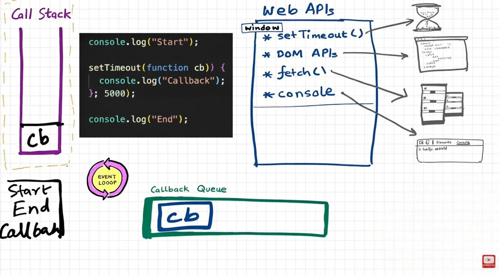
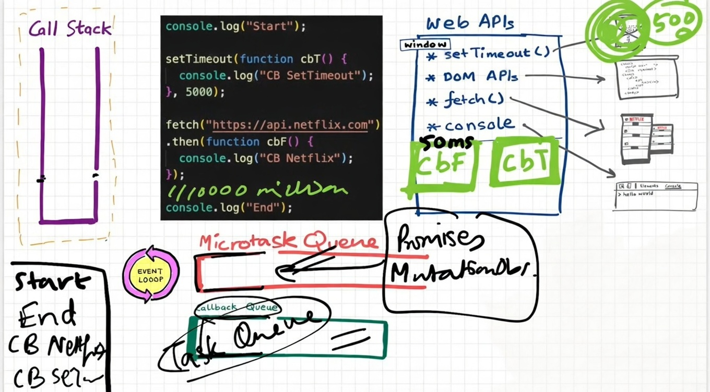

# 🧠 JavaScript Event Loop, Call Stack & Asynchronous Execution

This repository explains how JavaScript executes code using the **Call Stack**, how it performs **asynchronous tasks** using **Web APIs**, and how the **Event Loop**, **Callback Queue**, and **Microtask Queue** work together.

---

## 1️⃣ How JavaScript Executes Code (Call Stack)

```js
function a() {
    console.log("a");
}

a();
console.log("END");
```

### How this runs:

1. JavaScript creates a **Global Execution Context (GEC)**.
2. `a()` is called → a **local execution context** is pushed onto the **Call Stack**.
3. `"a"` is printed.
4. The function finishes → its execution context is popped.
5. `"END"` is printed.
6. When the script finishes, the GEC is removed.

JavaScript executes everything inside a **single-threaded Call Stack**.

---

## 2️⃣ How JavaScript Handles Asynchronous Tasks

JavaScript is **single-threaded**, so it cannot wait or pause execution.  
To handle async operations, the browser provides **Web APIs** such as:

- `setTimeout`
- DOM APIs
- `fetch`
- `localStorage`
- `console`
- etc.

These APIs are provided via the **global object (`window`)**.

---

## 3️⃣ Web APIs & Global Object

In the browser:
```js
window.setTimeout()
window.fetch()
window.document.getElementById()
```

These are not part of the JS engine — they are provided by the browser environment.

---

## 4️⃣ How `setTimeout` Works
### 📊 How `setTimeout` Works — Visual Diagram

<p align="center">
  
  <br>
  <b>Flow of setTimeout: Call Stack → Web APIs → Callback Queue → Event Loop → Call Stack</b>
</p>

```js
console.log("Start");

setTimeout(function cb() {
    console.log("Callback");
}, 5000);

console.log("End");
```

### Execution order:
```
Start
End
Callback   // after 5 seconds
```

### What happens behind the scenes:
1. `setTimeout` is sent to **Web APIs**.
2. A timer is started in the browser.
3. JS continues executing other code.
4. After 5 seconds, the callback is moved to the **Callback Queue**.
5. The **Event Loop** pushes it to the **Call Stack** when the stack is empty.

---

## 5️⃣ Event Loop & Callback Queue

The **Event Loop** continuously checks:
- Is the Call Stack empty?
- Are there callbacks waiting?

If yes → it moves the first callback from the **Callback Queue** to the **Call Stack**.

This is how async callbacks get executed.

---

## 6️⃣ How Event Listeners Work

```js
console.log("Start");

document.getElementById("ClickMe").addEventListener("click", function cb() {
    console.log("Callback");
});

console.log("End");
```

When the user clicks the button:
1. The browser registers the event via Web APIs.
2. When clicked, the callback is placed into the **Callback Queue**.
3. The Event Loop sends it to the Call Stack when free.

Multiple clicks → multiple callbacks queued.

---

## 7️⃣ fetch(), Promises & Microtask Queue
### 📊 fetch(), Promises & Microtask Queue — Visual Diagram

<p align="center">
  
  <br>
  <b>Promise callbacks go to the Microtask Queue, which has higher priority than the Callback Queue</b>
</p>


```js
console.log("Start");

setTimeout(function cb() {
    console.log("Callback");
}, 5000);

fetch("https://api.netflix.com").then(function cbF() {
    console.log("CB Netflix");
});

console.log("End");
```

### Important behavior:
- `fetch()` returns a **Promise**
- `.then()` callbacks go into the **Microtask Queue**
- `setTimeout` callbacks go into the **Callback (Macrotask) Queue**

---

## 8️⃣ Microtask Queue Has Higher Priority

When the Call Stack is empty:

1. Event Loop checks **Microtask Queue**
2. Executes all microtasks
3. Only then checks the **Callback Queue**

Microtasks include:
- `.then()`, `.catch()`, `.finally()`
- MutationObserver

---

## 9️⃣ Starvation of Callback Queue

If Microtasks keep getting added:
- The Callback Queue tasks (like `setTimeout`) may never execute
- This is called **starvation**

---

# 🧠 Final Summary

| Component | Role |
|--------|------|
| Call Stack | Executes JS code |
| Web APIs | Handle timers, fetch, DOM |
| Callback Queue | Stores setTimeout & event callbacks |
| Microtask Queue | Stores Promise callbacks |
| Event Loop | Moves tasks to call stack |
| Global Object | Exposes browser APIs |

---