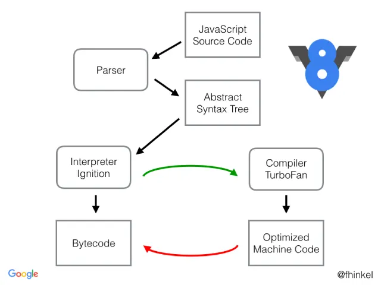

# 🧠 JavaScript Engine & Runtime — How JavaScript Really Works

This document explains how JavaScript code is executed behind the scenes using a **JavaScript Engine** and a **Runtime Environment**.

---

## 1️⃣ What Is a JavaScript Engine?

A **JavaScript Engine** is a **software program** (written in languages like C++) that executes JavaScript code.

It is responsible for:
- Parsing JavaScript
- Compiling it
- Executing it

JavaScript engines are **not hardware** — they are highly optimized software systems.

Examples:
- V8 (Chrome, Node.js)
- SpiderMonkey (Firefox)
- JavaScriptCore (Safari)

---

## 2️⃣ JavaScript Runtime Environment vs JavaScript Engine

| JavaScript Engine | JavaScript Runtime Environment |
|------------------|--------------------------------|
| Executes JavaScript code | Provides everything needed to run JS |
| Parses, compiles, executes | Includes Web APIs, Event Loop, Queues |
| Example: V8 | Browser or Node.js |

The **runtime environment** includes:
- JavaScript Engine
- Event Loop
- Callback Queue
- Microtask Queue
- Web APIs (setTimeout, DOM, fetch, etc.)

This is why JavaScript can interact with the browser and network.

---

## 3️⃣ Why Can JavaScript Run Everywhere?

JavaScript runs anywhere a **runtime environment** exists:

- Browsers
- Servers (Node.js)
- IoT devices (smartwatches, smart bulbs, etc.)

Each environment provides:
```
JavaScript Engine + APIs + Event Loop
```

This makes JavaScript platform-independent.

---

## 4️⃣ How JavaScript Code Is Executed

JavaScript code goes through three main phases:

### a) Parsing
- JS code is read by the engine
- It is broken into tokens
- An **AST (Abstract Syntax Tree)** is created

### b) Compilation
Modern engines use **JIT (Just-In-Time) Compilation**:
- Code is compiled while it is running
- Optimized machine code is generated
- Some parts may also use AOT (Ahead-Of-Time)

### c) Execution
- Code runs inside:
  - **Call Stack**
  - **Memory Heap**
- Variables and functions get memory
- Garbage Collection removes unused memory

---

## 5️⃣ V8 Engine Architecture
### 🧩 V8 Engine Architecture — Visual Diagram

<p align="center">
  
  <br>
  <b>V8 JavaScript Engine: Ignition, TurboFan, Heap, and Garbage Collector</b>
</p>

V8 is Google’s JavaScript engine used in Chrome and Node.js.

| Component | Role |
|--------|------|
| Ignition | Interpreter |
| TurboFan | Optimizing Compiler |
| Orinoco | Garbage Collector |
| Memory Heap | Stores objects & variables |
| Call Stack | Tracks execution order |

V8 constantly optimizes code to run JavaScript as fast as possible.

---

## 6️⃣ Is JavaScript Interpreted or Compiled?

JavaScript is **both**.

Originally, JavaScript was interpreted.

Modern engines:
- Interpret code first
- Then compile hot code using JIT
- Re-optimize when needed

So JavaScript behaves like a **hybrid language**.

---

## 7️⃣ Garbage Collection

JavaScript automatically manages memory.

V8 uses **Mark & Sweep**:
- Marks all objects still in use
- Removes objects that are unreachable

This prevents memory leaks in most cases.

---

## 8️⃣ Key Takeaways

✔ Understanding the runtime is essential  
You cannot fully understand JavaScript without knowing how the engine and runtime work.

✔ JavaScript engines are highly optimized  
They use:
- AST parsing
- JIT compilation
- Inline caching
- Memory optimization

✔ Execution Pipeline

```
Parsing → Compilation → Execution → Garbage Collection
```

✔ The JavaScript Environment adds power  
Features like `setTimeout`, `fetch`, DOM APIs, and queues are part of the runtime — not the JavaScript language itself.

--